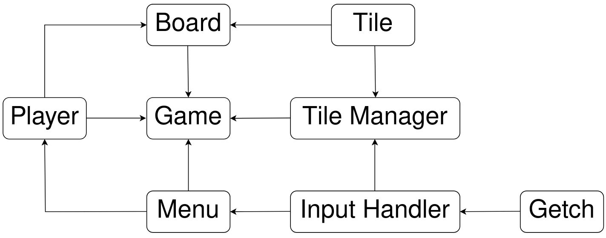
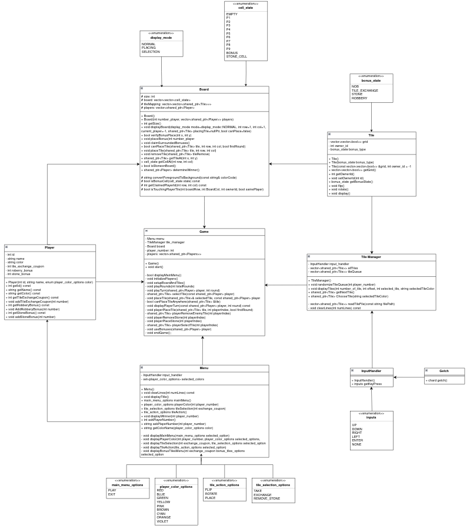

## Technical Documentation for "Laying Grass" Game

### Table of Contents
1. [Introduction](#1-introduction)
2. [Project Structure and Organization](#2-project-structure-and-organization)
   - [Simplified Codebase Interaction Diagram](#21-simplified-codebase-interaction-diagram)
   - [UML Diagram](#22-ulm-diagram)
3. [Compilation and Execution](#3-compilation-and-execution)
4. [User Interaction and Controls](#4-user-interaction-and-controls)
   - [Keyboard Input Handling](#41-keyboard-input-handling)
   - [Navigating Through Menus](#42-navigating-through-menus)
   - [Tile Placement Controls](#43-tile-placement-controls)
5. [Display and Graphics](#5-display-and-graphics)
   - [Board Representation](#51-board-representation)
   - [RGB ANSI Terminal Color Compatibility](#52-rgb-ansi-terminal-color-compatibility)
6. [Conclusion](#6-conclusion)

### 1. **Introduction**

This document explains the design and implementation details of the **"Laying Grass"** game, adapted from the "Laying Grass" segment featured in the Netflix reality game show, **The Devil's Plan** (Episode 8). The objective is to build the largest square-shaped territory using grass tiles on a grid-based board.

### 2. **Project Structure and Organization**

The project is structured into different modules, each responsible for a specific part of the game logic. Below is the folder hierarchy:

```
project_root/
├── main.cpp                   # Entry point of the application
├── src/                       # Source files
│   ├── tile.cpp               # Tile representation and manipulation
│   ├── tile_manager.cpp       # Manages tile distribution and exchanges
│   ├── getch.cpp              # Handles non-blocking keyboard input
│   ├── menu.cpp               # Displays and handles the main game menu
│   ├── game.cpp               # Core game logic
│   ├── board.cpp              # Game board representation and manipulation
│   ├── player.cpp             # Player attributes and actions
│   └── input_handler.cpp      # Handles user input validation and processing
├── include/                   # Header files
│   ├── tile.hpp
│   ├── tile_manager.hpp
│   ├── getch.hpp
│   ├── menu.hpp
│   ├── game.hpp
│   ├── board.hpp
│   ├── player.hpp
│   └── input_handler.hpp
├── data/                      # External data
│   └── tiles.txt              # Predefined tile configurations
├── obj/                       # Compiled object files
├── README.md                  # User documentation and usage instructions
└── Makefile                   # Compilation instructions
```

#### 2.1 **Simplified Codebase Interaction Diagram**


#### 2.2 **ULM Diagram**


### 3 **Compilation and Execution**

The project uses a **Makefile** for streamlined compilation and execution. This helps automate the build process, ensuring that the correct files are compiled with the necessary flags.

**To compile the project**, run:
```bash
make
```

**To clean the build directory**, run:
```bash
make clean
```

**To execute the game**, run:
```bash
./laying_grass
```

### 4. **User Interaction and Controls**

The game is designed as a **Command Line Interface (CLI)** and relies heavily on keyboard input for a smooth and interactive user experience.

#### 4.1 **Keyboard Input Handling**

- **`getch()` Function**: The game uses the `getch()` function to capture keyboard inputs without waiting for the Enter key. This function provides non-blocking input capture, enabling real-time interaction.
- **Platform Limitation**: The `getch()` method is implemented specifically for **Linux systems** using the termios library. As a result, this game is **Linux-specific** and may not work natively on other operating systems like Windows or macOS without adaptation.

#### 4.2 **Navigating Through Menus**

- The user navigates the menu options using the following keys:
  - **`Z` or `Up Arrow`**: Move up in the menu
  - **`S` or `Down Arrow`**: Move down in the menu
  - **`Enter`**: Select the highlighted option

#### 4.3 **Tile Placement Controls**

When placing tiles, players can control the position and orientation of tiles using:
- **`Z` or `Up Arrow`**: Move the tile up
- **`Q` or `Left Arrow`**: Move the tile left
- **`S` or `Down Arrow`**: Move the tile down
- **`D` or `Right Arrow`**: Move the tile right
- **`Enter`**: Confirm tile placement

### 5. **Display and Graphics**

#### 5.1 **Board Representation**

The game board and player tiles are represented using special characters to enhance the visual experience in the CLI:
- **`██`**: Player's tile (colored according to the player's chosen color)
- **`◢◣`**: Bonus square (colored based on bonus type)
- **`  `**: Empty space
- **Color Codes**: The game uses ANSI escape codes for color representation in the terminal. For instance:
  - Green: Tile Exchange Bonus
  - Grey: Stone Tile
  - Cream: Robbery Tile

#### 5.2 **RGB ANSI Terminal Color Compatibility**

To enhance the visual appeal and player experience, the **"Laying Grass"** game employs **RGB ANSI escape codes** for terminal coloring. This technique allows the game to render a wider spectrum of colors beyond the standard 8 or 16-color palette. Using RGB values gives precise control over the display colors, providing a richer and more immersive graphical experience in the command-line interface.

##### **Terminal Compatibility**
- **RGB ANSI Colors** are supported by most modern terminal emulators, such as:
  - **GNOME Terminal** (Ubuntu)
  - **Konsole** (KDE Plasma)
  - **Alacritty**, **Kitty**, and **Terminator**
- **Note**: Legacy terminals or older versions like the default terminal on older Linux distributions may not support RGB ANSI codes. To fully enjoy the game's colors and visual elements, it is recommended to use a compatible and modern terminal emulator.

By leveraging RGB ANSI colors, the game provides a visually distinct and intuitive experience, making it easier for players to differentiate between tile types and special bonuses based on their color coding.

### 6. **Conclusion**

This project showcases an interactive CLI-based game with well-structured code and a modular design. By leveraging efficient keyboard input handling and a user-friendly display, the "Laying Grass" game offers an engaging and competitive experience for players. 

The combination of tile placement strategy, resource management with coupons, and real-time decision-making creates a dynamic gameplay experience. Additionally, the use of enums and a structured approach to input handling ensures a responsive and smooth interface.

---

This technical documentation should help any developer or contributor understand the organization, core components, and interaction details of the project. For installation and user-specific instructions, please refer to the **User Documentation** ([`user_documentation.md`](./user_documentation.md)).

If there are any questions about specific modules or features, please feel free to ask!covers the implementation details necessary for understanding and extending the project. For player instructions and usage details, please refer to the **User Documentation** ([`user_documentation.md`](./user_documentation.md)).
